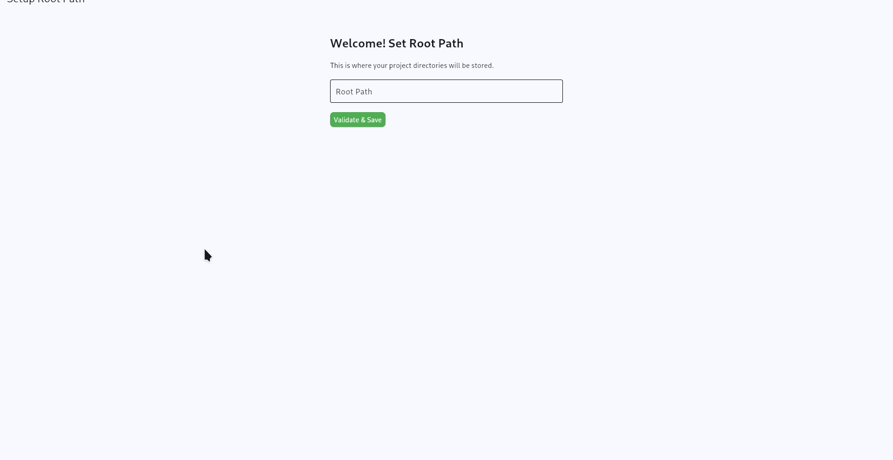

# Config Wizard

A modern, user-friendly GUI application for managing Docker Compose projects. Built with Python and Flet, Config Wizard provides an intuitive interface to create, configure, and manage your Docker containers without needing to edit YAML files manually.



## Features

- **Visual Project Management** - Create and manage Docker Compose projects through a clean GUI
- **Container Configuration** - Easily configure containers with ports, volumes, environment variables, and dependencies
- **Real-time Status Monitoring** - View running/stopped status of projects and individual containers
- **One-click Operations** - Start/stop projects with a single click
- **Live Editing** - Modify project configurations on the fly
- **Organized Workspace** - All projects stored in a configurable root directory

## Installation

### Prerequisites

- Python 3.10 or higher
- Docker and Docker Compose
- Git

### Steps

1. **Clone the repository**
   ```bash
   git clone <your-repo-url>
   cd config-wizard
   ```

2. **Create a virtual environment** (recommended)
   ```bash
   python -m venv venv
   source venv/bin/activate  # On Windows: venv\Scripts\activate
   ```

3. **Install dependencies**
   ```bash
   pip install -r requirements.txt
   ```

4. **Run the application**
   ```bash
   python main.py
   ```

## License

This project is licensed under the MIT License - see the [LICENSE](LICENSE) file for details.